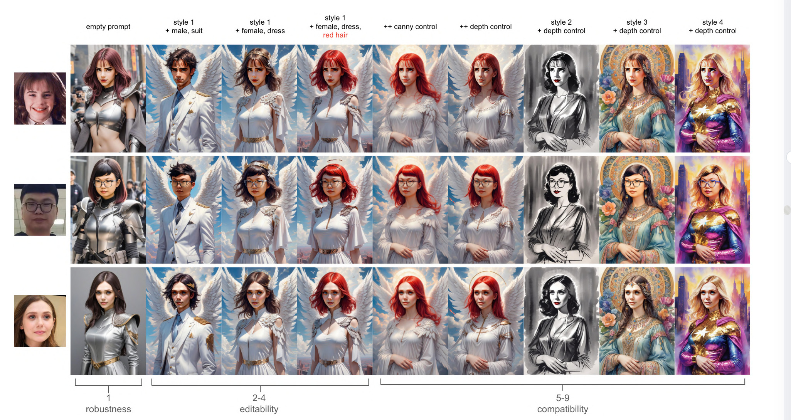
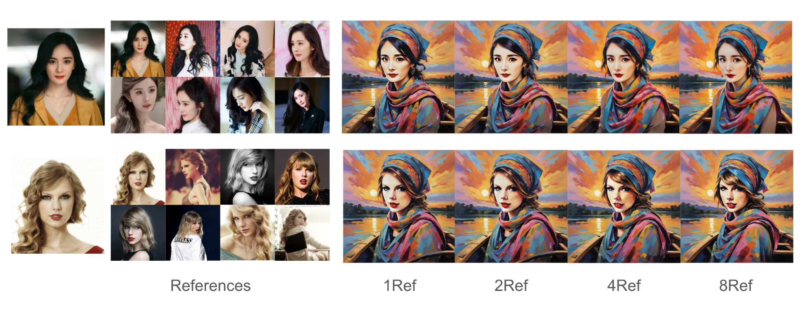
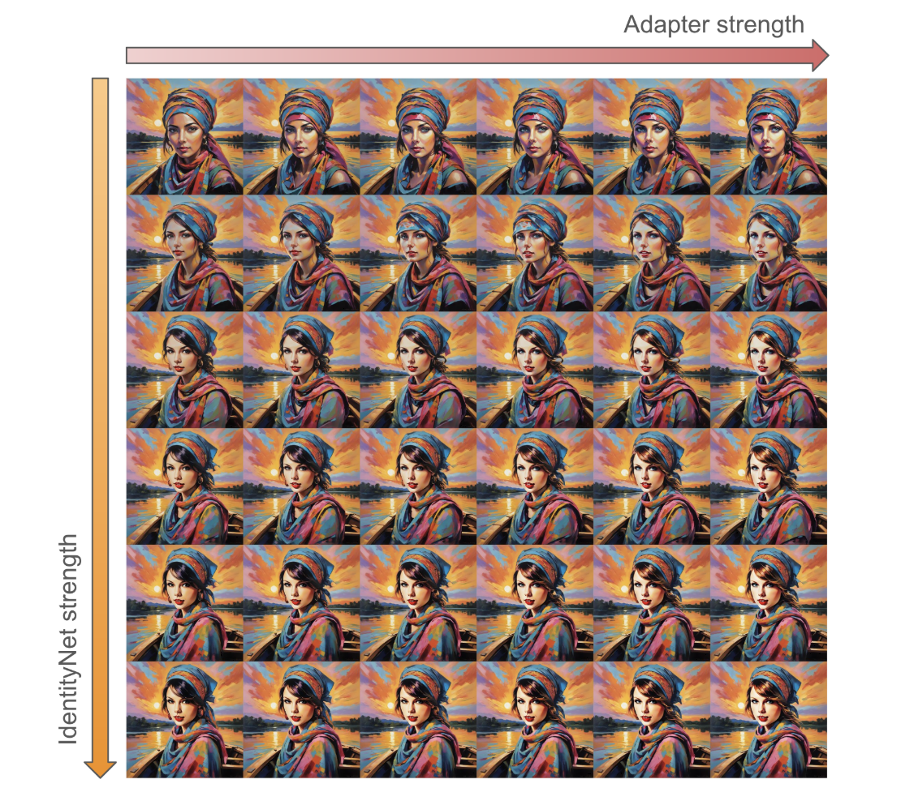
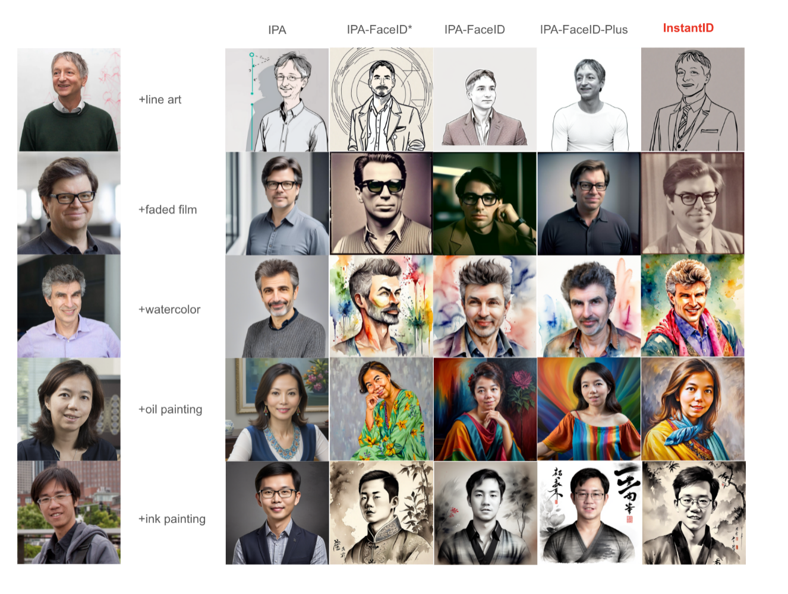
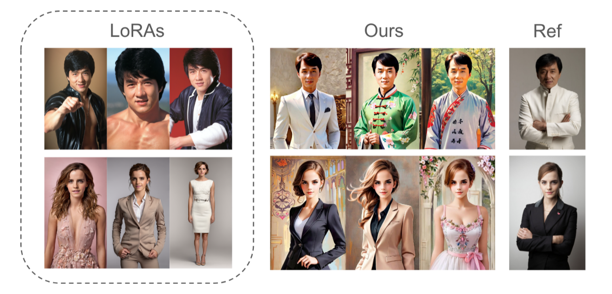
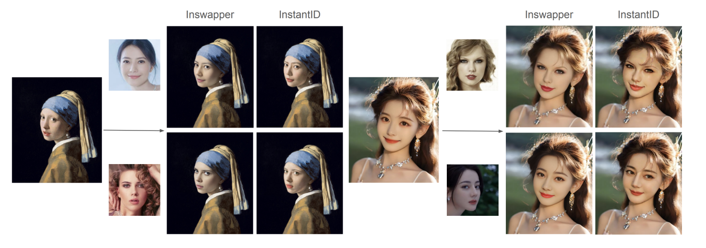

Fig. 1. The awesome team of InstantID in author order, generated with InstantID.

# Information

**paper**: InstantID: Zero-shot Identity-Preserving Generation in Seconds

**report**: https://arxiv.org/abs/2401.07519

**code**: https://github.com/InstantID/InstantID

**demo**: https://instantid.github.io

# Problems

**personalized image synthesis / identity-preserving image synthesis**

previous methods constraint:

1. Subject-driven Image Generation Methods (Textual Inversion, DreamBooth, LoRA)

   (1) high storage demands; 

   (2) lengthy fine-tuning processes; 

   (3) the need for multiple reference images.

2. ID Preserving Image Generation Methods (FaceStudio、PhotoMaker、IP-Adapter)

   (1) extensive fine-tuning across numerous model parameters; 

   (2) lack compatibility with community pre-trained models; 

   (3) fail to maintain high face fidelity.

**Difference:** category 1 needs multiple ref. images, while category 2 just need one image and only a single forward inference.

**InstantID advance:** lightweight adapter, plug-and-play, image personalization in various styles, a single facial image, high fidelity.

# Methodology

Fig. 2. The overall pipeline of our proposed InstantID.

## **Three crucial components**

​	(1) An ID embedding that captures robust semantic face information; 

​	(2) A lightweight adapted module with decoupled cross-attention, facilitating the use of an image as a visual prompt;

​	(3) An IdentityNet that encodes the detailed features from the reference facial image with additional spatial control.

## **Corresponding details**

​	(1) First, we adopt a face encoder instead of CLIP to extract semantic face features and use a trainable projection layer to project them to the space of text features. We take the projected feature as face embedding. 

​	(2) Then, a lightweight adaptive module with decoupled cross-attention is introduced to support images as prompts. 

​	(3) Finally, we propose IdentityNet to encode complex features in reference facial images with additional weak spatial control. 

In IdentityNet, the generation process is fully guided by face embedding without any textual information. Only newly added modules are updated, while the pre-trained text-to-image model remains frozen to ensure flexibility. After training, users can generate ID-preserving images of any style in high fidelity for free.

### 	**ID Embedding** 

​		this paper's target: stronger semantic details and enhanced fidelity in the ID preservation task.

​		CLIP's limitation: training on weakly aligned data.

​		In our research, we leverage a pre-trained face model to detect and extract face ID embedding from the reference facial image, providing us with strong identity features to guide the image generation process.

​		*A critical question: How do we effectively inject the identity features into the diffusion models?*

### 	**Image Adapter**

​		Employing ID embedding as image prompt, as opposed to the coarse-aligned CLIP embedding. This choice is aimed at achieving a more nuanced and semantically rich prompt integration.

### 	**IdentityNet**

​		In our adaptation of ControlNet, there are mainly two modifications: 

​			(1) Instead of fine-grained OpenPose facial keypoints, we use only five facial keypoints (two for the eyes, one for the nose, and two for the mouth) for conditional input;

​			(2) We eliminate the text prompts and use ID embedding as conditions for cross-attention layers in the ControlNet.

## Training and Inference Strategies

Only optimize the parameters of the Image Adapter and the IdentityNet while keeping the parameters of the pre-trained diffusion model frozen.

(read original paper for more details)

# Experiments and Results

Qualitative Results

Fig. 3. Demonstration of the robustness, editability, and compatibility of InstantID.

Fig. 3 description: Column 1 shows the result of Image Only results where the prompt is set to empty during inference. Columns 2-4 show the editability through text prompt. Columns 5-9 show the compatibility with existing ControlNets (canny & depth).

Fig. 4. Effect of the number of reference images.

Fig. 4 description: For multiple reference images, we take the average mean of ID embeddings as image prompt. InstantID is able to achieve good results even with only one single reference image. (A result of Ablative Study meanwhile)

Fig. 5. Effect of Image Adapter and IdentityNet.

Fig. 5 description: The x-axis and y-axis correspond to the weight strength of Image Adapter and IdentityNet respectively. (Ablative Study Result)

Fig. 6. Comparison of InstantID with other methods conditioned on different characters and styles.

Fig. 6 description: From left to right are IP-Adapter-SDXL, IPAdapter-SDXL-FaceID (* indicates experimental version), IP-Adapter-SD1.5-FaceID, IP-Adapter-SD1.5-FaceID-Plus. As shown in the figure, we found that the IP-Adapter that relies on CLIP embedding cannot achieve facial fidelity, and also leads to the degradation of prompt control to generate styles. IP-Adapter-FaceID introduces face embedding, which improves face fidelity, but it still cannot achieve high fidelity. IPAdapter-FaceID-Plus combines the embedding of face and CLIP, which can achieve good facial fidelity, but there is a style degradation problem, resulting in the face being unable to blend into the background style. In contrast, our proposed InstantID is compatible with various styles while maintaining high fidelity.

Fig. 7. Comparison of InstantID with pre-trained character LoRAs.

Fig. 8. Comparison of InstantID with InsightFace Swapper.

(read the original paper appendix for more results)

# Conclusion

InstantID: a solution for zero-shot identity-preserving generation with a simple plug-and-play module.

What it can do: adeptly handle image personalization in any style using only one facial image while maintaining high fidelity.

Two core design: An Image Adapter that enhances facial detail fidelity and an IdentityNet that ensures strong ID control to preserve complex facial features.

Superiority: plug-and-play nature enhance compatibility with community pre-trained models,  only need single image, maintain high face fidelity.

Challenge: The ID embedding in our model, while rich in semantic information like gender and age, has highly coupled facial attributes, which poses a challenge for face editing.
