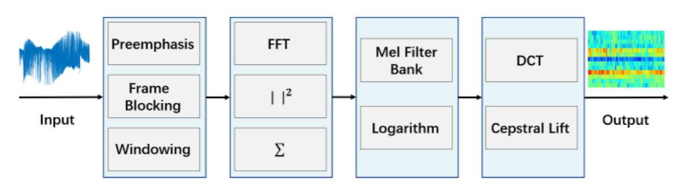
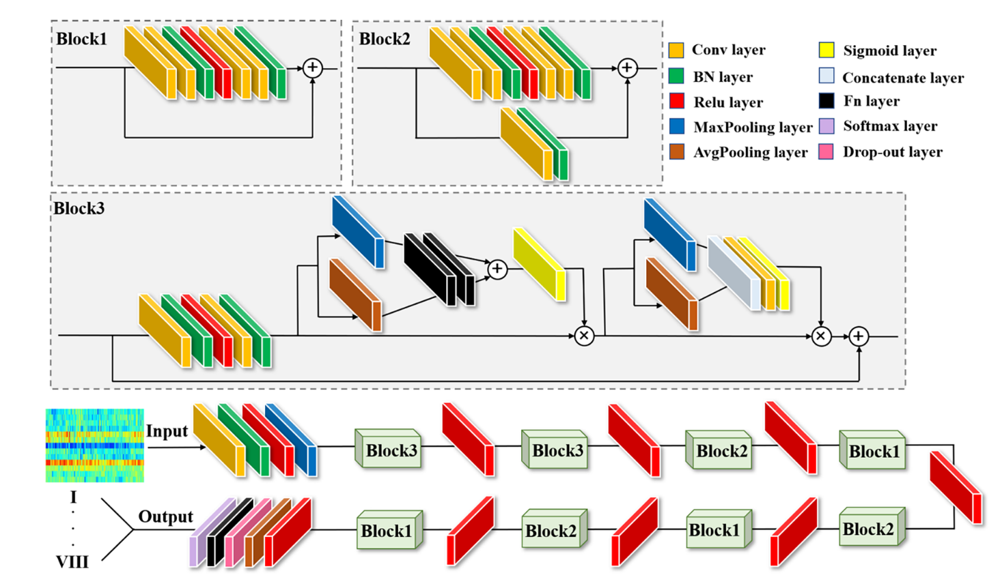
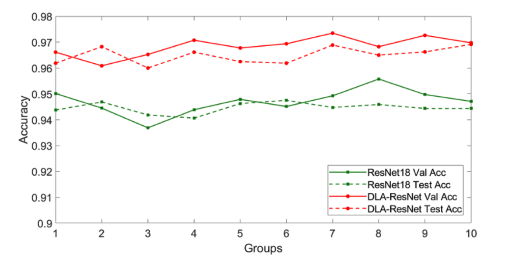
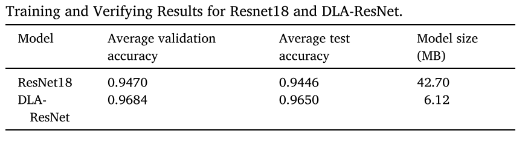

# Information

**paper**: A light-weight neural network for marine acoustic signal recognition suitable for fiber-optic hydrophones

**report/doi**: 10.1016/j.eswa.2023.121235

**code**: none

**demo**: none

# Problems

光纤水听器事件分类

深度学习模型识别精度高，但参数量大，实时性差，海洋调查船终端部署困难。

# Methodology

对接收的信号进行处理（MFCC），输出就是图像。

在resnet18中引入深度可分离卷积（DSC）和卷积块注意力模块（CBAM），得到DLA-ResNet。

# Experiments and Results

8分类。

和普通的resnet18相比，DLA-ResNet在val和test上的精度提升了差不多两个点，模型也很小（6.12 MB，resnet18为42.7 MB）。

# Conclusion

作者使用MFCC变换，将信号转为图像。在resnet18中，引入DSC和CBAM，来进行光纤水听器的8种事件分类。

引入DSC增强实时性，减小模型大小，引入CBAM提升精度。
